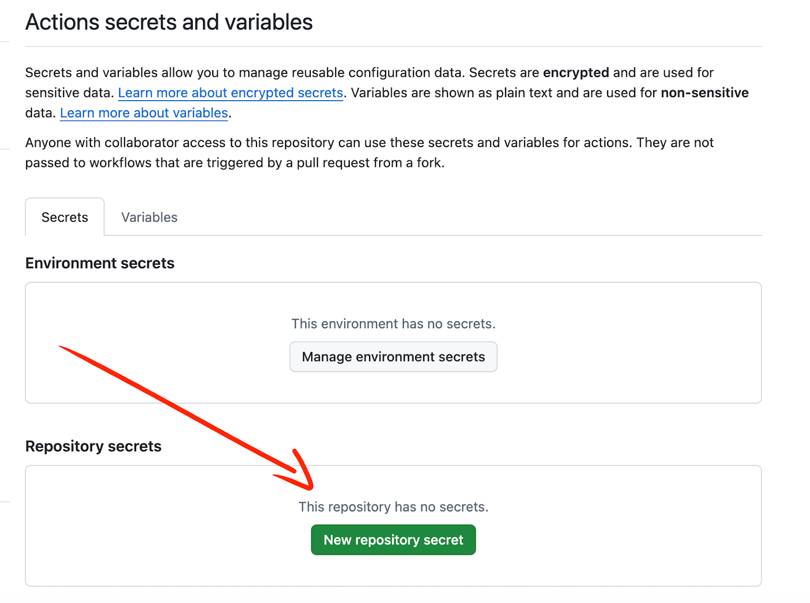

### **Introduction**

This recipe doc intends to explain you on how you can create CI/CD workflow with Hasura DDN using Github actions. We’ll use short form `GH` for “github” throughout this doc.

This document will focus on creating builds for metadata as well as connector in one command approach. For separate build workflow (one for metadata and one for connector), for now, we will advise devising the workflow on your own by taking this document as baseline.

**🟥Important**: This guide assumes you are using “**single supergraph”** for your Hasura DDN project. For multiple supergraph(s), we’ll recommend different recipe or another solution for that scenario but you can take this as inspiration.

### **Pre-requisite**

- Hasura DDN local project setup (please refer the [quickstart](https://hasura.io/docs/3.0/quickstart/) doc for setting up local DDN project)
- [Github](http://github.com) account (existing).
- Create/Existing account on [console.hasura.io](http://console.hasura.io) (Hasura DDN console)
- One cloud project (You can perform `ddn project init` on your local DDN setup and it will create one)

### **Managing environments with Hasura context**

A typical context (located in `.hasura/context.yaml`) would look like (in case if you have performed `ddn project init` )

```json
   prod:
     project: myproject-prod
     supergraph: ../supergraph.yaml
     subgraph: ../app/subgraph.yaml
     localEnvFile: ../.env.cloud
     cloudEnvFile: ../.env.prod
```

We can create multiple contexts per environment. You can read more in detail about managing contexts over [here](https://hasura.io/docs/3.0/project-configuration/project-management/manage-contexts).

Coming back, when you initialize a DDN project locally, it comes with one context `default` . We are going to assume you have one context which comes with DDN setup locally. When you run `ddn project init` , it will create a project on DDN cloud and assign it as value to `project` for the context you are currently using , i.e. `default` context .

**For contexts more than default/local:**  
Just like example above, you can create new context and assign values to it . The fields which will vary are the `project`, `localEnvFile` and `cloudEnvFile`. For contexts other than `default` and `local`, lets point `localEnvFile` to `.env.cloud` for environments other than default/local as we don’t emphasize on it’s local env file.

Create env files for each environment , for example `.env.prod` , copy contents of base `.env` file and replace the values where needed. Mostly, we’ll replace value of connection string with that of specific environment but you can also replace another env var values as per your need for that specific environment.

What we’ll need to change

- `project`
- `localEnvFile`
- `cloudEnvFile`

Subgraph value can be any file path to `subgraph.yaml` you want to attach. The supergraph value should point to single supergraph

If you have different supergraph(s) files for specific environments, please do mention the same for specific context.

For now we’ll create a context `cloud` which emphasizes the cloud environment. Copy the project name which would have been created (can be found under `default` context) when you had performed `ddn project init` .

```
   cloud:
     project: <project_name>
     supergraph: ../supergraph.yaml
     subgraph: ../app/subgraph.yaml
     localEnvFile: ../.env.cloud
     cloudEnvFile: ../.env.prod
```

Here’s how my context file would look like with multiple environments  


### **Create GH Action Secret**

Before going forward, we will need to create new repository on [github.com](http://github.com) which we will use it as remote for our local git project  


Once you’ve created a new repository, copy the remote url as mentioned in screenshot below (we’ll need it later)


Perform below commands in your project’s root directory

```shell
# this will initialize new empty git repository (local)
git init

# checkout to cloud branch
git checkout -b "development"

# Local - set config user.name to the github username of your account (Don't set if done globally)
git config user.name <your_github_username>

# Local - set config user.email to the email associated with github account (Don't set if done globally)
git config user.email <email_associated_with_github_account>

# add git remote URL (which you've copied from above)
​​git remote add origin <remote_repository_url_you_copied_above>

#IMPORTANT: Make sure you've .gitignore file which includes env files and other secret/private/confidential files  . Ensuring this means we are not exposing secrets/credentials to the remote repository

# stage and add commit
git add .
git commit -m "init: ddn local setup"

# push the changes to remote repository
git push -u origin development

# checkout to a new branch called "cloud"
git checkout -b "cloud"
git push -u origin cloud

```

We will make use of GH action secret to store contents of .env files as well as service PAT (access token) for respective environment.

Steps (to create secret)

- Go to GH repo \-\> Settings \-\> Secrets and Variables \-\> Actions . Make sure you’ve selected “Secrets” tab and then click on “New Repository Secret”.
- Input the name of secret you want to use and copy the value of that from respective source and paste it into Secret input box.

For example, if you have `.env.qa` file for QA environment values, you can create GH action secret like `DDN_ENV_QA` and copy the contents of whole `.env.qa` file and paste it directly into secret value input. I’ve described example as screenshot below.

We already have cloud env, so we’ll create DDN_ENV_CLOUD by copying contents of `.env.cloud` .



Once you click on that, you will be landed on below page.


What we’ll need to store as part of GH action secrets

- One secret for env var values \- Env file values (as per above example)
- Another secret to store service account PAT(access token) for each cloud project/environment.

For service account PAT, please generate PAT with access level of “admin” for the respective cloud project. We have a docs page for this \- please follow all 4 steps as mentioned [here](https://hasura.io/docs/3.0/project-configuration/project-management/service-accounts/#how-to-create-service-account).

Once that is done, create another secret with prefix name `DDN_SERVICE_ACCOUNT_ACCESS_TOKEN_` and the suffix should be the env, for example `DDN_SERVICE_ACCOUNT_ACCESS_TOKEN_CLOUD`

For example, I will name my secret `DDN_ENV_CLOUD` where cloud is my context/environment name as well as DDN

Once we‘ve created these secrets with their respective values, we are good to go ahead

- `DDN_ENV_CLOUD`
- `DDN_SERVICE_ACCOUNT_ACCESS_TOKEN_CLOUD`

### **Writing workflow job**

This is where we’ll describe GH action to perform certain steps as part of our deployment pipeline. I assume you have enabled version control on your local repo and your every push to remote is configured to correct GitHub repository (as per pre-requisite step 2).

We will create necessary workflow files for github actions

First checkout to development branch

```
git checkout development
```

Open terminal/bash in root of your DDN project directory and perform the following:

```
mkdir -p .github/workflows
touch .github/workflows/build-and-apply.yaml
touch .github/workflows/only-build.yaml
```

Open VS code editor , and modify the files below with the code we’ve given.

only-build.yaml

```xml
name: DDN supergraph build workflow

on:
 # Trigger on pull request merge to "cloud" or other branches you want
 pull_request:
   types: [closed]
   branches:
     - cloud

jobs:
 deploy:
   # Run only when PR is merged (not when it's just closed without merging)
   if: (github.event_name == 'pull_request' && github.event.pull_request.merged == true && (github.base_ref == 'cloud'))
   runs-on: ubuntu-latest
   steps:
     - name: Checkout code
       uses: actions/checkout@v3

     - name: Install DDN CLI
       run: |
         curl -L https://graphql-engine-cdn.hasura.io/ddn/cli/v4/get.sh | bash

     - name: Determine branch name
       id: branch-name
       run: |
         if [ "${{ github.event_name }}" = "pull_request" ]; then
           BRANCH_NAME="${{ github.base_ref }}"
         else
           BRANCH_NAME="${{ github.event.inputs.environment }}"
         fi
         echo "BRANCH_NAME=$BRANCH_NAME" >> $GITHUB_ENV
         echo "branch=$BRANCH_NAME" >> $GITHUB_OUTPUT

     - name: Create branch-specific env file from secret and Login to DDN CLI for cloud
       if: env.BRANCH_NAME != 'main'
       run: |
         echo "Creating ${{ env.BRANCH_NAME }} file"
         # Create .env file for
         touch .env.${{ env.BRANCH_NAME }}

         # Write secret to .env.{branch} file
         cat << EOF > .env.${{ env.BRANCH_NAME }}
         ${{ secrets[format('DDN_ENV_{0}',env.BRANCH_NAME)] }}
         EOF

         # Make sure the file is readable but secure
         chmod 600 .env.${{ env.BRANCH_NAME }}

         echo "Performing login via DDN CLI ..."
         ddn auth login --access-token ${{ secrets[format('DDN_SERVICE_ACCOUNT_ACCESS_TOKEN_{0}', env.BRANCH_NAME)] }}

     - name: Set Context to Current Branch
       run: |
         echo "Setting context to ${{ env.BRANCH_NAME }}"
         ddn context set-current-context ${{ env.BRANCH_NAME }}

     - name: Check if subgraph exists or not for current env/context and create one if it's missing
       run: |
         # Create an array to store missing subgraphs
         missing_subgraphs=()

         # Extract subgraph paths from supergraph.one.yaml
         echo "Extracting subgraphs from supergraph.one.yaml..."
         config_subgraphs=()

         while IFS= read -r line; do

           # Skip commented lines and extract only valid paths
           if [[ $line =~ ^[[:space:]]*-[[:space:]]*([^#]+) ]]; then

             # Extract the path and trim whitespace
             path="${BASH_REMATCH[1]}"
             path=$(echo "$path" | xargs)

             # Extract just the directory name (e.g., "globals" from "globals/subgraph.yaml")
             subgraph_name=$(echo "$path" | cut -d'/' -f1)
             config_subgraphs+=("$subgraph_name")
             echo "Found subgraph in config: $subgraph_name"
           fi
         done < <(grep -A 100 "subgraphs:" supergraph.one.yaml | grep -v "^kind\|^version\|^definition\|^subgraphs:")

         # Get current project from context
         echo "Getting current project from context..."
         context_output=$(ddn context get-current-context --out json)
         project_value=$(echo "$context_output" | jq -r '.values.project')
         echo "Current project: $project_value"

         # Get existing subgraphs from project
         echo "Getting existing subgraphs from project..."
         existing_subgraphs_output=$(ddn project subgraph get --project "$project_value" --out json)

         # Check which subgraphs are missing
         echo "Checking for missing subgraphs..."
         for subgraph in "${config_subgraphs[@]}"; do
           exists=$(echo "$existing_subgraphs_output" | jq -r ".[] | select(.name == \"$subgraph\") | .name")
           if [[ -z "$exists" ]]; then
             echo "Subgraph '$subgraph' is missing in the project"
             missing_subgraphs+=("$subgraph")
           else
             echo "Subgraph '$subgraph' already exists"
           fi
         done

         # Create missing subgraphs
         if [[ ${#missing_subgraphs[@]} -eq 0 ]]; then
           echo "No missing subgraphs to create"
         else
           echo "Creating missing subgraphs..."
           for subgraph in "${missing_subgraphs[@]}"; do
             echo "Creating subgraph '$subgraph'..."
             ddn project subgraph create "$subgraph" --project "$project_value"
           done
         fi

     - name: Create supergraph build
       run: |
         # Create the supergraph build and you can apply manually later via CLI or UI
         ddn supergraph build create

```

build-and-apply.yaml

```xml
name: DDN supergraph build and apply workflow

on:
 # Trigger on pull request merge to "cloud" or other branches you want
 pull_request:
   types: [closed]
   branches:
     - cloud

jobs:
 deploy:
   # Run only when PR is merged (not when it's just closed without merging)
   if: (github.event_name == 'pull_request' && github.event.pull_request.merged == true && (github.base_ref == 'cloud'))
   runs-on: ubuntu-latest
   steps:
     - name: Checkout code
       uses: actions/checkout@v3

     - name: Install DDN CLI
       run: |
         curl -L https://graphql-engine-cdn.hasura.io/ddn/cli/v4/get.sh | bash

     - name: Determine branch name
       id: branch-name
       run: |
         if [ "${{ github.event_name }}" = "pull_request" ]; then
           BRANCH_NAME="${{ github.base_ref }}"
         else
           BRANCH_NAME="${{ github.event.inputs.environment }}"
         fi
         echo "BRANCH_NAME=$BRANCH_NAME" >> $GITHUB_ENV
         echo "branch=$BRANCH_NAME" >> $GITHUB_OUTPUT

     - name: Create branch-specific env file from secret and Login to DDN CLI for cloud
       if: env.BRANCH_NAME != 'main'
       run: |
         echo "Creating ${{ env.BRANCH_NAME }} file"
         # Create .env file for
         touch .env.${{ env.BRANCH_NAME }}

         # Write secret to .env.{branch} file
         cat << EOF > .env.${{ env.BRANCH_NAME }}
         ${{ secrets[format('DDN_ENV_{0}',env.BRANCH_NAME)] }}
         EOF

         # Make sure the file is readable but secure
         chmod 600 .env.${{ env.BRANCH_NAME }}

         echo "Performing login via DDN CLI ..."
         ddn auth login --access-token ${{ secrets[format('DDN_SERVICE_ACCOUNT_ACCESS_TOKEN_{0}', env.BRANCH_NAME)] }}

     - name: Set Context to Current Branch
       run: |
         echo "Setting context to ${{ env.BRANCH_NAME }}"
         ddn context set-current-context ${{ env.BRANCH_NAME }}

     - name: Check if subgraph exists or not for current env/context and create one if it's missing
       run: |
         # Create an array to store missing subgraphs
         missing_subgraphs=()

         # Extract subgraph paths from supergraph.one.yaml
         echo "Extracting subgraphs from supergraph.one.yaml..."
         config_subgraphs=()

         while IFS= read -r line; do

           # Skip commented lines and extract only valid paths
           if [[ $line =~ ^[[:space:]]*-[[:space:]]*([^#]+) ]]; then

             # Extract the path and trim whitespace
             path="${BASH_REMATCH[1]}"
             path=$(echo "$path" | xargs)

             # Extract just the directory name (e.g., "globals" from "globals/subgraph.yaml")
             subgraph_name=$(echo "$path" | cut -d'/' -f1)
             config_subgraphs+=("$subgraph_name")
             echo "Found subgraph in config: $subgraph_name"
           fi
         done < <(grep -A 100 "subgraphs:" supergraph.one.yaml | grep -v "^kind\|^version\|^definition\|^subgraphs:")

         # Get current project from context
         echo "Getting current project from context..."
         context_output=$(ddn context get-current-context --out json)
         project_value=$(echo "$context_output" | jq -r '.values.project')
         echo "Current project: $project_value"

         # Get existing subgraphs from project
         echo "Getting existing subgraphs from project..."
         existing_subgraphs_output=$(ddn project subgraph get --project "$project_value" --out json)

         # Check which subgraphs are missing
         echo "Checking for missing subgraphs..."
         for subgraph in "${config_subgraphs[@]}"; do
           exists=$(echo "$existing_subgraphs_output" | jq -r ".[] | select(.name == \"$subgraph\") | .name")
           if [[ -z "$exists" ]]; then
             echo "Subgraph '$subgraph' is missing in the project"
             missing_subgraphs+=("$subgraph")
           else
             echo "Subgraph '$subgraph' already exists"
           fi
         done

         # Create missing subgraphs
         if [[ ${#missing_subgraphs[@]} -eq 0 ]]; then
           echo "No missing subgraphs to create"
         else
           echo "Creating missing subgraphs..."
           for subgraph in "${missing_subgraphs[@]}"; do
             echo "Creating subgraph '$subgraph'..."
             ddn project subgraph create "$subgraph" --project "$project_value"
           done
         fi

     - name: Create supergraph build
       run: |
         # Create the supergraph build and you can apply manually later via CLI or UI
         ddn supergraph build create --apply


```

Push the changes to development branch

```
git add .
git commit -m "add: added workflow files"
git push -u origin development
```

Now you can go ahead and create PR with **base set as “cloud”** and **compare set as “development”**. Once you create PR , then review the changes thoroughly. Once you’ve reviewed changes, you can merge the PR. This will trigger workflow as we’ve documented in workflow file that on which event this workflow will get triggered.

You can check the workflow runs in “Actions” tab in your repository. It will show if workflow run was succeeded or failed with error trace details.


Note: While getting service account token, just not only copy the token, select “Admin” and then click on “Grant access” button as mentioned in screenshot below.


### Viewing builds in GraphiQL

Once those actions were successful, you would see two builds in the Hasura console. One which is created by `only-build` workflow and another created by `build-and-apply` workflow. The 2nd build was automatically applied. You can keep whatever workflow you want , or both of them.


