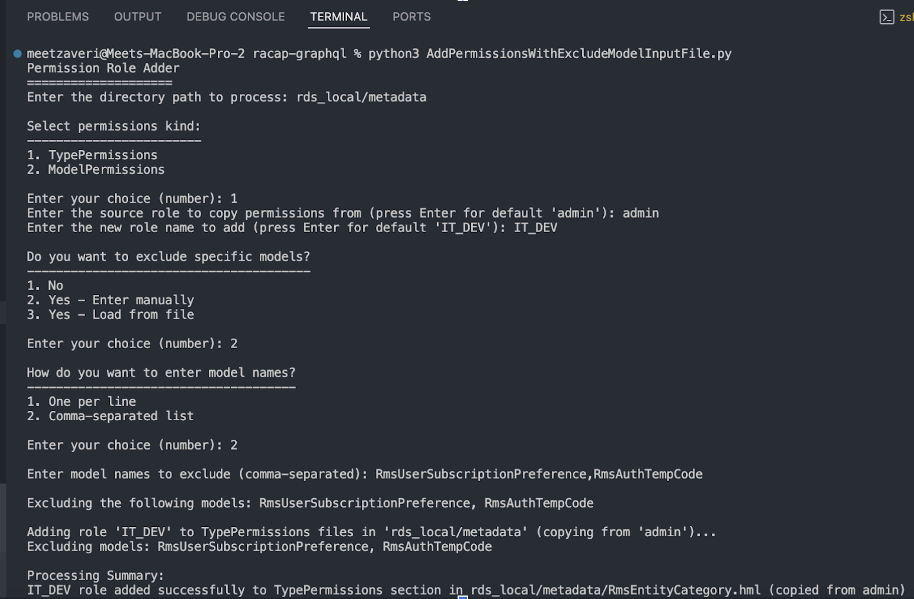

### What is this for ?

This python script is helpful in case if you want to clone an existing role permission , say role: admin and create a new role with permissions cloned from that role. It will take specific model's existing permission as a context while cloning the permission.

In other words - to update existing TypePermissions/ModelPermissions by cloning it from source role and applying it to new role and it will replicate the same across your subgraph’s metadata directory.

### Pre-requisites

- Python3 should be installed on your machine **(MUST HAVE)**
- Working DDN supergraph.
- Enable git on your project **(MUST HAVE)**. As a good practice , Make sure the existing changes you’ve , should be committed before we execute python script.

### Usage:

Make sure you create this python file inside your supergraph’s root directory.

You can simply run python script where it will ask for few inputs regarding

- Your metadata directory
- Permissions kind -> `TypePermissions` or `ModelPermissions`
- Models to be excluded - if you wish to exclude certain models from applying permissions, you can pass them as list or pass a .txt file containing that list (comma-seperated) as an input
- Source role from which you want to copy
- And the new role name for which it will update the .hml file

#### Edge cases tested ✅

- If there is already an existing role in particular .hml file which was supplied via input prior to execution, then it will skip for that specific permission_kind.
- Ensure it copies the entire ModePermission or TypePermission from the source role up until it’s last field.
- Ignores the files which does not contain `kind: TypePermissions` or `kind: ModelPermissions` , for example `<connector>.hml` and `<connector>-types.hml` files.

#### Remember

- If you want to revert the change in case it’s unexpected for you, and since it’s git enabled (source controlled), you can just use VS Code or GUI to discard changes or use `git reset + git checkout .` to undo all uncommitted changes.

#### Input prompt preview

Here's the screenshot of simple input prompt


So the control flow would look like

- If user is interested to exclude some models (y/n), they’ll be shown following output
  - 1. No
  - 2. Yes - Enter manually
  - 3. Yes - Load from file
    - You can choose either of 2 or 3 to supply it as input or load from .txt file (comma-seperated).
    - IF NO, then replicate the source role permissions to every models.

##### **Input format for excluding list of models**

You can supply it via manual string in input prompt or load it as part of another file (.txt)

- List of Model names separated by commas. You can find Model name inside definition of `kind: Model` in .hml file.

#### Python script

This can be found in UpdatePermissions.py file in this same directory or you can copy it from below.

```py
import os
import re

def check_model_exclusion(file_path, excluded_models):
   """
   Check if the file contains a Model with a definition.name that's in the excluded list.
   Returns True if the model should be excluded, False otherwise.
   """
   try:
       with open(file_path, 'r') as file:
           content = file.read()

       # Look for all Model sections
       model_sections = re.finditer(r'kind:\s*Model\s+version:\s*v\d+\s+definition:', content, re.DOTALL)

       for match in model_sections:
           start_pos = match.start()
           # Find the relevant section after the match
           section_start = content[start_pos:]

           # Extract the name using regex
           name_match = re.search(r'definition:(?:\s+[^\n]*\n)*?\s+name:\s*([^\s\n]+)', section_start)
           if name_match:
               model_name = name_match.group(1)
               if model_name in excluded_models:
                   return True, model_name

       return False, None
   except Exception as e:
       print(f"Error checking model exclusion in {file_path}: {str(e)}")
       return False, None

def add_custom_role_to_permissions(file_path, role_name, permissions_kind, source_role, excluded_models=None):
   # Check if this file contains a model that should be excluded
   if excluded_models:
       should_exclude, model_name = check_model_exclusion(file_path, excluded_models)
       if should_exclude:
           return f"Skipping {file_path}: Contains excluded model '{model_name}'"

   # Read the file content
   try:
       with open(file_path, 'r') as file:
           content = file.read()

       # Process the file line by line to identify the right section
       lines = content.split('\n')

       # Variables to track our position in the file
       in_target_permissions = False
       target_permissions_start = -1
       target_permissions_end = -1
       source_role_start = -1
       source_role_end = -1

       # First, find the target permissions section
       for i, line in enumerate(lines):
           # Check if we're entering the target permissions section
           if f'kind: {permissions_kind}' in line:
               in_target_permissions = True
               target_permissions_start = i
               continue

           # Check if we're entering a different section or at the end of the file
           if in_target_permissions and (line.strip().startswith('kind:') or line.strip() == '---'):
               target_permissions_end = i
               in_target_permissions = False
               break

       # If we reached the end of the file while still in the target permissions section
       if in_target_permissions:
           target_permissions_end = len(lines)

       # If we didn't find the target permissions section
       if target_permissions_start == -1:
           return f"No {permissions_kind} section found in {file_path}"

       # Check if the role already exists in the target permissions section only
       target_section = '\n'.join(lines[target_permissions_start:target_permissions_end])
       role_pattern = re.compile(r'^\s*- role: ' + re.escape(role_name) + r'\s*$', re.MULTILINE)
       if role_pattern.search(target_section):
           return f"Skipping {file_path}: {role_name} role already exists in {permissions_kind} section"

       # Reset for finding source role
       in_target_permissions = False

       # Look for source role within the target permissions section
       for i, line in enumerate(lines):
           # Check if we're entering the target permissions section
           if f'kind: {permissions_kind}' in line:
               in_target_permissions = True
               continue

           # Check if we're entering a different section or at the end of the file
           if in_target_permissions and (line.strip().startswith('kind:') or line.strip() == '---'):
               in_target_permissions = False
               break

           # Look for source role only within target permissions sections
           if in_target_permissions and re.match(r'\s*- role: ' + re.escape(source_role) + r'\s*$', line):
               source_role_start = i

               # Find the end of source role block
               source_indent = len(line) - len(line.lstrip())
               j = source_role_start + 1

               while j < len(lines):
                   # Check if we've reached the end of the file
                   if j == len(lines) - 1:
                       source_role_end = j + 1
                       break

                   # Empty line
                   if not lines[j].strip():
                       source_role_end = j
                       break

                   # Document separator
                   if lines[j].strip() == '---':
                       source_role_end = j
                       break

                   # Next role or section (same indentation level or less)
                   if lines[j].strip() and len(lines[j]) - len(lines[j].lstrip()) <= source_indent:
                       if lines[j].lstrip().startswith('-') or not lines[j].lstrip().startswith(' '):
                           source_role_end = j
                           break

                   j += 1

               if source_role_end == -1:
                   source_role_end = len(lines)

               # Break out of the loop once we've found the source role
               break

       # Check if we found the source role
       if source_role_start == -1:
           return f"No {source_role} role found in {permissions_kind} section in {file_path}"

       # Extract source role content
       source_role_lines = lines[source_role_start:source_role_end]
       source_role_content = '\n'.join(source_role_lines)

       # Create new role content
       new_role_content = source_role_content.replace(f'role: {source_role}', f'role: {role_name}')

       # Build new content
       new_lines = lines[:source_role_end]
       new_lines.append(new_role_content)
       new_lines.extend(lines[source_role_end:])
       new_content = '\n'.join(new_lines)

       # Write the modified content back to the file
       with open(file_path, 'w') as file:
           file.write(new_content)

       return f"{role_name} role added successfully to {permissions_kind} section in {file_path} (copied from {source_role})"
   except Exception as e:
       return f"Error processing {file_path}: {str(e)}"

def process_directory(directory_path, role_name, permissions_kind, source_role, excluded_models=None):
   results = []

   # Walk through the directory
   for root, _, files in os.walk(directory_path):
       for file in files:
           if file.endswith('.hml'):
               file_path = os.path.join(root, file)
               result = add_custom_role_to_permissions(file_path, role_name, permissions_kind, source_role, excluded_models)
               results.append(result)

   return results

def display_menu(title, options):
   """Display a menu with numbered options and return the selected option."""
   print(f"\n{title}")
   print("-" * len(title))

   for i, option in enumerate(options, 1):
       print(f"{i}. {option}")

   while True:
       try:
           choice = int(input("\nEnter your choice (number): "))
           if 1 <= choice <= len(options):
               return options[choice-1]
           else:
               print(f"Please enter a number between 1 and {len(options)}")
       except ValueError:
           print("Please enter a valid number")

def load_excluded_models_from_file(file_path):
   """Load list of models to exclude from a text file."""
   try:
       with open(file_path, 'r') as file:
           content = file.read()

       # Support both comma-separated and line-separated formats
       # First check if there are commas in the content
       if ',' in content:
           models = [model.strip() for model in content.split(',')]
       else:
           models = [line.strip() for line in content.splitlines()]

       # Remove empty entries
       models = [model for model in models if model]

       return models
   except Exception as e:
       print(f"Error loading excluded models from file: {str(e)}")
       return []

# Usage with interactive prompts
if __name__ == "__main__":
   import sys

   print("Permission Role Adder")
   print("====================")

   # Get directory path
   if len(sys.argv) > 1:
       directory_path = sys.argv[1]
   else:
       directory_path = input("Enter the directory path to process: ")

   # Get permissions kind using menu
   permissions_options = ["TypePermissions", "ModelPermissions"]
   permissions_kind = display_menu("Select permissions kind:", permissions_options)

   # Get source role
   source_role = input("Enter the source role to copy permissions from (press Enter for default 'admin'): ")
   if not source_role:
       source_role = "admin"

   # Get target role name
   role_name = input("Enter the new role name to add (press Enter for default 'IT_DEV'): ")
   if not role_name:
       role_name = "IT_DEV"

   # Ask if user wants to exclude specific models
   exclude_choice = display_menu("Do you want to exclude specific models?", ["No", "Yes - Enter manually", "Yes - Load from file"])

   excluded_models = None

   if exclude_choice == "Yes - Enter manually":
       input_format = display_menu("How do you want to enter model names?", ["One per line", "Comma-separated list"])

       excluded_models = []

       if input_format == "One per line":
           print("\nEnter model names to exclude (one per line, leave empty to finish):")
           while True:
               model = input("Model name to exclude (or press Enter to finish): ").strip()
               if not model:
                   break
               excluded_models.append(model)
       else:  # Comma-separated
           models_input = input("\nEnter model names to exclude (comma-separated): ").strip()
           if models_input:
               excluded_models = [model.strip() for model in models_input.split(',')]
               excluded_models = [model for model in excluded_models if model]  # Remove empty entries

   elif exclude_choice == "Yes - Load from file":
       file_path = input("\nEnter the path to the file containing excluded models: ").strip()
       if os.path.exists(file_path):
           excluded_models = load_excluded_models_from_file(file_path)
           print(f"Loaded {len(excluded_models)} models from {file_path}")
       else:
           print(f"File not found: {file_path}")
           exclude_again = input("Do you want to enter another file path? (y/n): ").lower()
           if exclude_again.startswith('y'):
               while True:
                   file_path = input("Enter the path to the file containing excluded models: ").strip()
                   if os.path.exists(file_path):
                       excluded_models = load_excluded_models_from_file(file_path)
                       print(f"Loaded {len(excluded_models)} models from {file_path}")
                       break
                   else:
                       print(f"File not found: {file_path}")
                       try_again = input("Try another file? (y/n): ").lower()
                       if not try_again.startswith('y'):
                           break

   if excluded_models:
       print(f"\nExcluding the following models: {', '.join(excluded_models)}")

   print(f"\nAdding role '{role_name}' to {permissions_kind} files in '{directory_path}' (copying from '{source_role}')...")
   if excluded_models:
       print(f"Excluding models: {', '.join(excluded_models)}")

   results = process_directory(directory_path, role_name, permissions_kind, source_role, excluded_models)

   # Print results
   print("\nProcessing Summary:")
   for result in results:
       print(result)

   # Count statistics
   added_count = sum(1 for r in results if "added successfully" in r)
   skipped_exclude_count = sum(1 for r in results if "Contains excluded model" in r)
   skipped_exists_count = sum(1 for r in results if "already exists" in r)
   error_count = sum(1 for r in results if "Error" in r)

   print(f"\nTotal files processed: {len(results)}")
   print(f"Files modified: {added_count}")
   print(f"Files skipped (role already exists): {skipped_exists_count}")
   if excluded_models:
       print(f"Files skipped (excluded models): {skipped_exclude_count}")
   print(f"Errors encountered: {error_count}")

```
