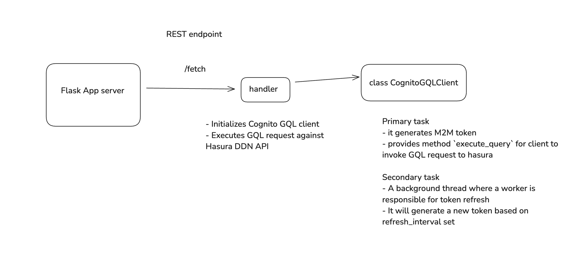

## Overview

This project contains flask app which we can use to serve as python API client where any other client can make a request and execute GQL request to Hasura. Internally it manages to generate token from AWS Cognito first and then use it as JWT token for making a request to hasura API.

It also has token refresh mechanism which periodically checks if token is expired and if it's expired , then it will generate a new token.

## Local Development

### Usage (for local development)

This is a working demo of a flask app in which we will use python API client. This python API client requires certain third-party packages in order to work such as `requests` and `python-dotenv`.

You can either

- install those packages globally OR
- (RECOMMENDED) use a virtual environment, install necessary packages and run python project .

```
python3 -m venv "path-to-your-venv-file"
source path-to-your-venv-file/bin/activate
pip install -r requirements.txt
```

Close the terminal session and re-open a new terminal session and run flask app server

```
flask run
```

This will launches a minimal Flask App server. It will by default run on port 5000.

### Important: Scaffolding .env file (for local development)

Since cognito GraphQL Client requires certain credentials, we'll need to create environment variables with correct values by cloning `.envexample` file.

- Cognito User Pool App Client ID
- Cognito User Pool App Client Secret
- Cognito User Pool Domain URL
- GraphQL Endpoint

## Structure

Here's the screenshot of how flask app server works with cognito GQL client module


`app.py` - The main `app.py` initiates flask app server with routes defined there. Here we have a multiple routes defined , i.e. REST endpoints. In POST request `/execute-graphql` , you can dynamically pass GQL query via body and it will execute against Hasura API.

`handlers/handler.py` - This file contains handler for function handlers of routes defined in flask app server.

`utils/cognitoGQLClient.py` - This file contains cognito GraphQL client module where we provide implementation on generating cognito token, executing GQL request and background worker thread to perform token refresh.

**Note**: Also make sure you have toggled API mode (from Hasura console) to "Public".
